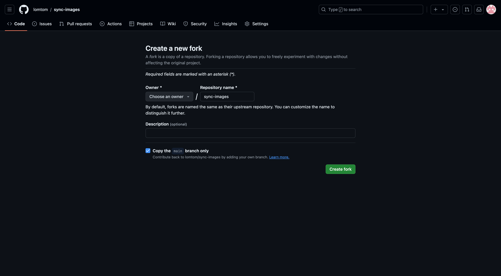
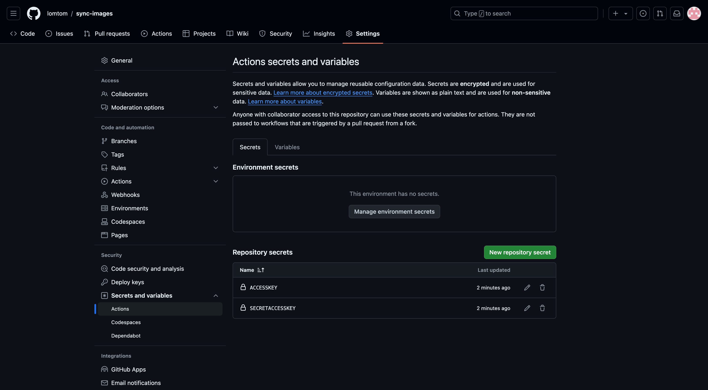
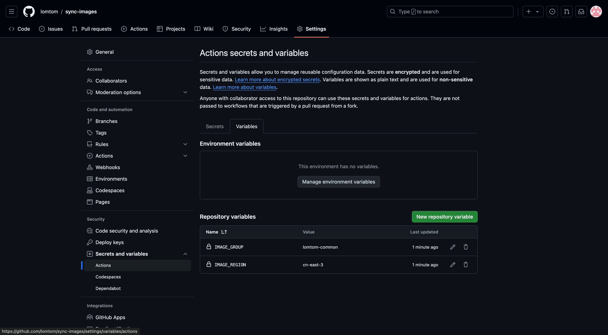
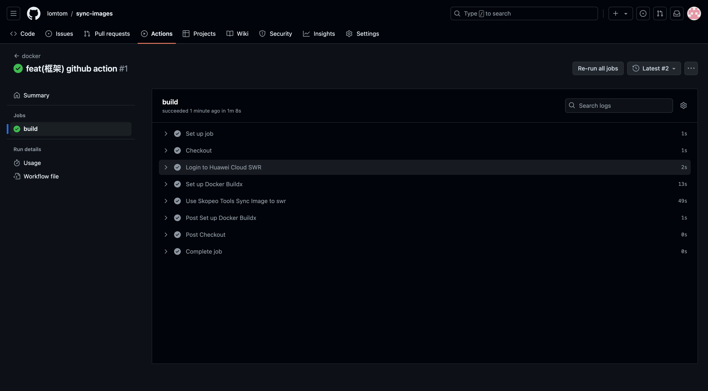
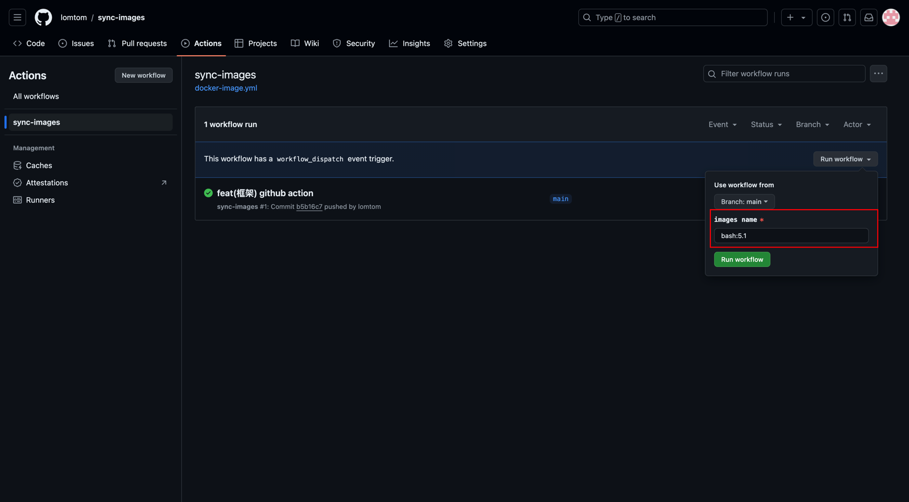
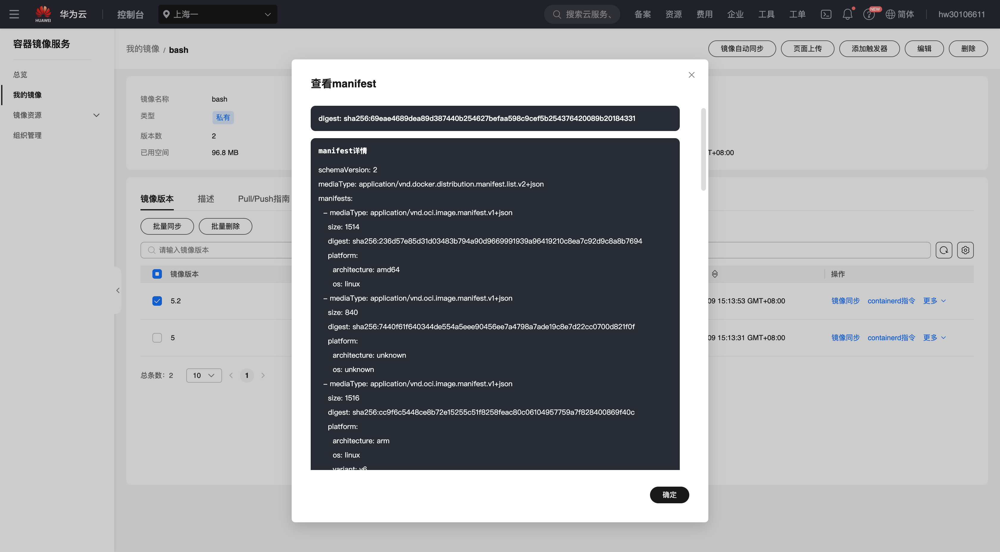

<h1 align=center>🔬无服务器同步dockerhub镜像到swr</h1>

<p align=center>在工作或学习中，有时需要将 DockerHub 上的镜像同步到个人仓库。本文将详细介绍如何将 DockerHub 镜像同步至华为云的 SWR（SoftWare Repository for Container），此方法简单易用，支持多架构。
</p>


<p align=center>
    <a target="_blank" href="https://lomtom.cn/sqotz1dtgj4s" rel="nofollow">
        🌏 🚀 WebSite
    </a> 
    <a href="https://github.com/lomtom/sync-images/blob/main/LICENSE">
        
    </a>
</p>

<p align=center>如果你觉得这个项目有用，请给它一个⭐以表示你的支持</p>

---


## 使用

### Step1：获取访问密钥（AK/SK）

1. 进入 [华为云访问密钥管理页面](https://console.huaweicloud.com/iam/?region=cn-east-3&locale=zh-cn#/mine/accessKey) ，点击“新增访问密钥”按钮，创建访问密钥。
2. 创建完成后下载访问密钥，访问密钥格式如下：
```
User Name 	Access Key Id					Secret Access Key
lomtom		*************					*****************
```

- 访问密钥（AK/SK，Access Key ID/Secret Access Key）包含访问密钥 ID（AK）和秘密访问密钥（SK）两部分。华为云通过 AK 识别访问用户身份，通过 SK 对请求数据进行签名验证，确保请求的机密性、完整性和请求者身份的正确性。详细信息请参阅 [访问密钥说明](https://support.huaweicloud.com/usermanual-ca/ca_01_0003.html)。

- 在后续步骤中，我们将使用 AK/SK 进行 SWR 操作。如果需要对子用户或更细粒度权限的控制，请参考 [管理IAM用户访问密钥](https://support.huaweicloud.com/usermanual-iam/iam_02_0003.html)

注意：访问密钥是访问华为云的重要凭证，只能下载一次，请妥善保管

### Step2：创建swr组织

1. 进入[swr组织页面](https://console.huaweicloud.com/swr/?region=cn-east-3#/swr/organization)，点击“创建组11织”按钮。
2. 例如，在“上海一”区域创建一个名为 lomtom-common 的组织。

后续操作将使用以下参数：

- 区域：cn-east-3
- 组织名称：lomtom-common

### Step3：Fork仓库

1. 访问[sync-images](https://github.com/lomtom/sync-images)仓库
2. 点击右上角的“Fork”按钮，将仓库 Fork 到你的 GitHub 账户中



### Step4：创建secrets 和 variables

1. 在 Fork 后的仓库中，点击“Settings”菜单，选择“Security”选项卡。
2. 点击“Actions”，进入 Actions secrets and variables 页面。
3. 在“Secrets”选项卡中，创建两个 Repository secrets：
    - ACCESSKEY：填写第一步中获取的 Access Key Id。
    - SECRETACCESSKEY：填写第一步中获取的 Secret Access Key。



4. 在“Variables”选项卡中，创建两个 Repository variables：
    - IMAGE_REGION：填写第二步中的区域值，例如 cn-east-3。
    - IMAGE_GROUP：填写第二步中的组织名称，例如 lomtom-common。



### Step5：同步镜像

有两种方式来同步镜像：

- 第一种：将 修改后的 images.txt 文件提交到仓库的main分支上
- 第二种：手动触发 GitHub Actions。

#### 方法一 

1. 配置完成后，同步镜像变得非常简单。只需修改仓库中的 images.txt 文件，例如需要同步 bash 的 5 和 5.2 两个版本，在 images.txt 中写入：

```
bash:5
bash:5.2
```

2. 将修改提交到 main 分支，等待 GitHub Actions 执行完毕。



#### 方法二

1. 点击仓库右上角的“Actions”按钮，进入 Actions 页面。

2. 在 Actions 页面中，选择“Sync Images”工作流，点击“Run workflow”按钮，填写镜像名称和版本，例如：bash :5.1，然后点击“Run workflow”按钮。



最终，您可以在 SWR 上查看到同步的所有镜像，包括镜像的所有架构。



## 申明：

本仓库旨在解决开发或运维过程中，由于 DockerHub 镜像仓库访问问题导致的工作阻塞问题。

<strong style="color:red;">本仓库及教程仅供学习参考，请勿用于非法用途。</strong>